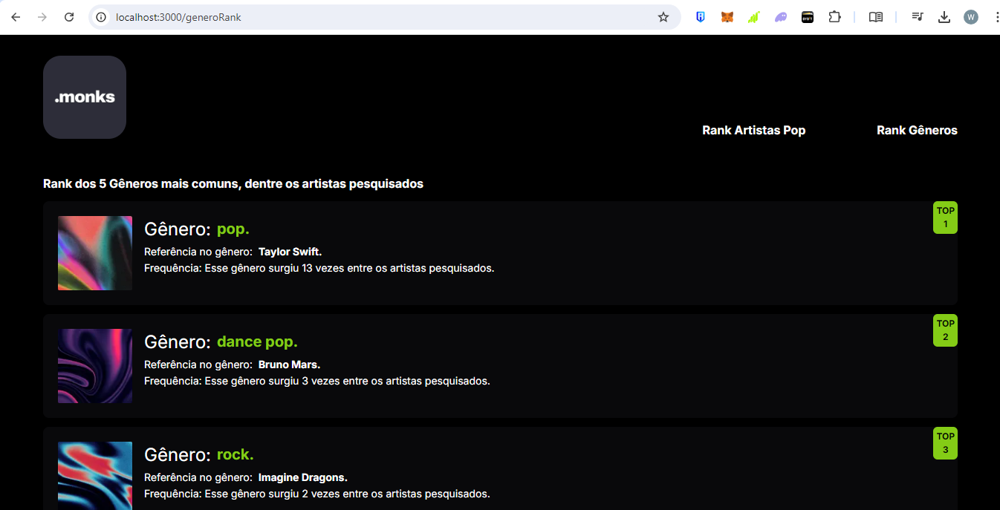
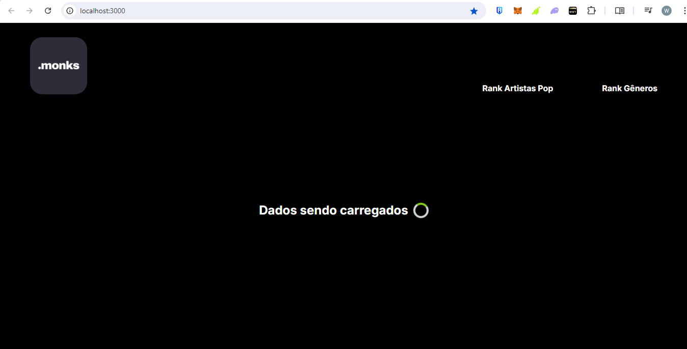
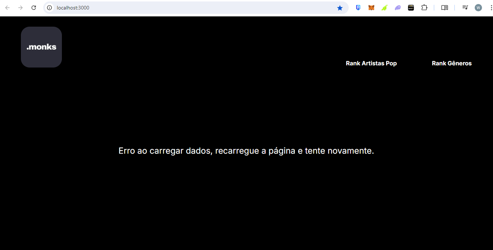

## FrontEnd-Monks-Desafio 🎧
Este repositório contém o código-fonte do front-end do desafio proposto pela Monks. A aplicação é uma interface web responsiva que consome a API do Spotify para exibir rankings de artistas e gêneros musicais, de uma lista pré-selecionada por eles. 

A proposta é construir um script que puxa as informações da API do Spotify, e realizar o devido tratamento dos dados extraídos, criando duas listas ordenadas: uma com os artistas do gênero pop ordenados por número de seguidores e outra com os 5 gêneros mais comuns entre estes artistas. Sendo necessário retornar em tela o Nome da/do artista, quantidade de seguidores e Popularidade (índice).

## Funcionalidades 🚀 


- Autenticação com Spotify: A aplicação se autentica com a API do Spotify utilizando o token de acesso do usuário. A lógica para esta requisição se encontra no arquivo 'src/service/authAccessToken'. Vale ressaltar que é imprescindível essa validação, para acessar os dados da API do Spotify; foram escritas instruções de onde e como construir essa autenticação mais abaixo, com links da documentação do Spotify.

- Requisições à API: Requisição GET para buscar informações detalhadas de artistas usando a API do Spotify. Lógica alocada no arquivo "src/service/hooks/useGetArtistsData". Após a request, os dados são salvos em um context no arquivo "src/context/dadosContext", para modelação e compartilhamento por toda aplicação.

- Estrutura de Requisições: As requisições GET para obtenção de dados foram estrategicamente otimizadas para serem executadas apenas uma vez durante o carregamento inicial da aplicação. Essa abordagem reduz significativamente a carga sobre a API e melhora a performance geral do front-end, proporcionando uma experiência mais rápida e fluida para o usuário. Além disso, essa otimização minimiza a latência e garante que os dados sejam recuperados de forma eficiente, resultando em uma navegação mais suave e responsiva.

- Envio de Dados: Realiza uma requisição POST para enviar dados dos ranks ao back-end para armazenamento e processamento posterior. O Back End está alocado neste mesmo repositório com instruções de como fazê-lo rodar; a lógica e função da chamada para rota do backend, se encontra no arquivo "src/service/postRanksData". 

- Responsividade e Animações: Layout totalmente responsivo, adaptado para diferentes resoluções de tela, garantindo uma experiência de usuário consistente em dispositivos móveis e desktop. Além disso, a aplicação conta com animações de slides e scale, otimizando ainda mais a experiência do usuário.

- Home Page: A HomePage da aplicação conta com um header, com os links de navegação para as páginas com os ranks e para home page clicando na logo da .Monks. Além disso, ocorre a renderização dos cards dos 15 artistas selecionados pela .Monks, a serem pesquisados por esta solução.
    <div aling='center'>
    
    </div> 


- Ranking de Artistas Pop mais populares: Clicando no link "Rank Artistas Pop" você será direcionado para a page que exibe os cards dos artistas mais populares do gênero pop entre a lista solicitada, ordenados com base no número de seguidores, do maior para o menor. Nestes Cards, são exibidos os dados fornecidos pela API Spotify: sua imagem, o nome do artista, os gêneros aos quais pertence, número de seguidores e sua popularidade no item "Índice"; 
    <div aling='center'>
    
    </div> 

- Ranking dos 5 Gêneros Musicais mais comuns: Clicando no link "Rank Gêneros" você será direcionado para a page que exibe os 5 cards dos gêneros musicais mais populares entre os 15 artistas selecionados pelo Desafio.
    <div aling='center'>
    
    </div> 

- Componente Loader e Erro: A aplicação também conta com um componente de loading que é acionado apenas enquanto ocorre uma request do tipo GET para acessar dados. Além disso, um componente de erro é acionado caso ocorra um GET de dados, que retorne algum erro.
    <div aling='center'>
    
    </div> 
    <div aling='center'>
    
    </div> 


## Tecnologias Utilizadas 🛠️
- React.js: Biblioteca JavaScript para construção da interface de usuário.
- Next.js: Framework React que possibilita renderização do lado do servidor (SSR) e geração de sites estáticos.
- Axios: Cliente HTTP utilizado para realizar as requisições GET e POST para a API do Spotify.
- Tailwind CSS: Framework CSS utilizado para estilizar a aplicação de forma eficiente e responsiva.

## Como Rodar o Projeto 🚀 

- Clone este repositório:

Copie o código abaixo, abra o bash ou terminal e cole:<br>
```
git clone https://github.com/WendelSantoss/Desafio-Monks-Spotify.git
```

- Navegue até a pasta do projeto:

Copie o código abaixo, abra o bash ou terminal e cole:<br>
```
cd FrontEnd-Desafio
```

- Instale as dependências:

Copie o código, abra o bash ou terminal:<br>
```
npm install
```

- Configuração da .env:

Após seu registro e a criação de um projeto no dashboard developer do Spotify (https://developer.spotify.com), é necessário alocar as credenciais dentro de um arquivo .env já que elas são de caráter privado. Você pode utilizar o .env.example, configurando-o para .env e alocando suas credenciais fornecidas pelo Spotify neste arquivo, desta forma:
```
NEXT_PUBLIC_SPOTIFY_CLIENT_ID=Digite aqui sua credencial ClientId
NEXT_PUBLIC_SPOTIFY_CLIENT_SECRET=Digite aqui sua credencial ClientSecret
```
OBS: A Aplicação só apresentará dados se você adicionar suas credenciais para acessar o Token do usuário, se você estiver tentando rodar esse projeto localmente. Lembrar de eleger o seu arquivo .env como arquivo ignorado no seu .gitgnore é importante para manter suas credenciais seguras. Para melhores instruções de como conseguir essas credenciais, você pode acessar a documentação do Spotify nos links a seguir: 
https://developer.spotify.com/documentation/web-api/tutorials/code-flow / https://developer.spotify.com/documentation/web-api/concepts/apps / https://developer.spotify.com/documentation/web-api/tutorials/client-credentials-flow .

- Execute a aplicação:

bash
Copiar código
```
npm run dev
```
Acesse a aplicação em http://localhost:3000.

- OBS: POST dos Ranks 

O Post dos dois ranks solicitados no desafio, só será executado se a aplicação Back-End presente neste Repositório, estiver rodando
no seu ambiente local. Logo, se você deseja visualizar se esta requisção está funcionando, basta abrir o arquivo "BackEnd-Spotify" aqui nesse repositório e seguir o passo passo descrito no seu Read.me.


## Deploy

No momento, a aplicação não possui nenhum deploy, porém passará por ajustes, após a avaliação do time .Monks, para deploy na vercel.